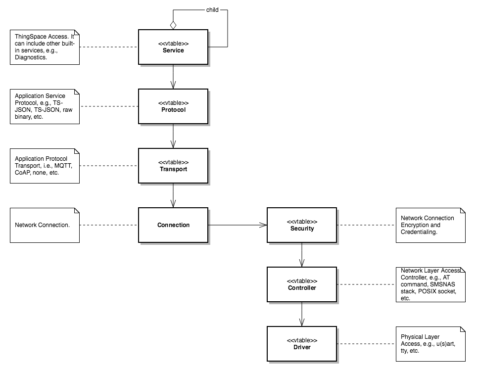

[Home](../README.md)

## Design

The SDK is designed to allow a developer to quickly prototype an IoT device on their desktop, as well as, implement an hardened application and cross-compile to a target MCU.

The SDK itself is composed of two main parts, the API, (seen in the [sdk](../sdk) directory), and its components (placed in the [sdk_components](../sdk_components) directory). If you have doxygen installed on your machine, you may obtain a detailed API description by running it in this directory (see the [Doxyfile](./Doxyfile)). However, an overview is provided here as well.

### Example
When creating a new application, the developer must first select a example platform from ./examples/platforms directory, or create their own by implementing the "ts_device" and "ts_platform" interfaces.

Although the SDK can be configured and customized in many various ways, the easiest use is demonstrated in ./examples/applications. There you may notice a simple application that sends sensor data, and acts on actuator commands using the ts_service interface (and ts_message abstraction). 

If you use the configuration as is, then a simple application can be implemented on you MAC or LINUX like the following example (see ./examples/applications/simple/main/c for the complete code listing),
```
int main() {

    // initialize the platoform (implemented per platform)
    ts_platform_initialize();

    // initialize sensor cache (its contents would come from the actual hardware)
    TsMessage_t sensor;
    ts_message_create( &sensor );
    ts_message_set_float( sensor, "temperature", 50.5 );
    
    // initialize the service
    TsServiceRef_t service;
    ts_service_create( &service );
    
    // register a message handler
    ts_service_dequeue( service, TsServiceActionMaskAll, handler );
    
    // connect to the cloud
    ts_service_dial( service, address );
    
    // start a single-threaded run-loop
    while( running ) {

        // send telemetry at some interval,...
        ts_service_enqueue( service, sensor );
        
        // pass control to the SDK for a period of time,...
        ts_service_tick( service, 5 * TS_TIME_SEC_TO_USEC );    
    }
    
    // clean-up
    ts_service_disconnect( service );
    ts_service_destroy( service );
}

// my message handler
static TsStatus_t handler( TsServiceRef_t service, TsServiceAction_t action, TsMessageRef_t message ) {

    // ... act on action and message ...
    return TsStatusOk;
}

```

### Components

The SDK is designed as described in the following UML diagram, and it can be customized at any point in the diagram where the stereotype, "vtable" is indicated. 



#### Service
An optional application protocol layer. Currently, only the deprecated TS-JSON and the new TS-CBOR protocols are supported.
##### Plugable?  
* Partially. Only the protocol portion of the service is currently "customizable".
##### Location and Definition?
* [sdk_components](../sdk_components/ts_components.c): ```ts_service : TsServiceVtable_t*```
* [sdk/include/ts_component.h](../sdk/include/ts_component.h)
##### Dependencies?
* Transport
* Platform

#### Transport
An optional application transport layer, e.g., MQTT, CoAP, XMPP, etc. Currently, only MQTT is supported.
##### Plugable?  
*  Yes
##### Location and Definition?
* [sdk_components](../sdk_components/ts_components.c): ```ts_transport : TsTransportVtable_t*```
* [sdk/include/ts_transport.h](../sdk/include/ts_transport.h)
##### Dependencies?
* Connection 
* Platform

#### Connection
Provides the semantics for a TCP/IP connection, it is itself composed of three other components: Security, Controller and Driver.
##### Plugable?  
* No
##### Location and Definition? 
* [sdk/include/ts_connection.h](../sdk/include/ts_connection.h)
##### Dependencies?
* Security
* Platform

#### Security 
Provides an optional application TLS layer via the Controller.
##### Plugable?  
* Yes
##### Location and Definition?
* [sdk_components](../sdk_components/ts_components.c): ```ts_security : TsSecurityVtable_t*```
* [sdk/include/ts_security.h](../sdk/include/ts_security.h)
##### Dependencies?
* Controller
* Platform

#### Controller
Provides an optional TCP/IP-centric module controller via the Driver.
##### Plugable?  
* Yes
##### Location and Definition?
* [sdk_components](../sdk_components/ts_components.c): ```ts_controller : TsControllerVtable_t*```
* [sdk/include/ts_controller.h](../sdk/include/ts_controller.h)
##### Dependencies?
* Driver
* Platform

#### Driver
Provides a TCP/IP-centric module driver.
##### Plugable?  
*  Yes
##### Location and Definition?
* [examples/platforms/[platform-specific-directory]](../examples/platforms): ```ts_driver : TsDriverVtable_t*```
* [sdk/include/ts_driver.h](../sdk/include/ts_driver.h)
##### Dependencies?
* Platform

### Other Components

#### Platform
This is defined by the platform, and provides the platform-specific implementation of functions like, printf, assert, random, etc.
##### Plugable?  
* Yes
##### Location and Definition?
* [examples/platforms/[platform-specific-directory]](../examples/platforms): ```ts_platform : TsPlatformVtable_t*```
* [sdk/include/ts_platform.h](../sdk/include/ts_platform.h)
##### Dependencies?
* *N/A*

#### Mutex
Not used by default. In rare cases when a SDK component is threaded, it will use the platform specific mutex defined using this interface to coordinate those threads.
##### Plugable?  
* Yes
##### Location and Definition?
* [examples/platforms](../examples/platforms/ts_platforms.c): ```ts_mutex : TsMutexVtable_t*```
* [examples/platforms/[platform-specific-directory]](../examples/platforms): ```ts_mutex : TsMutexVtable_t*```
* [sdk/include/ts_mutex.h](../sdk/include/ts_mutex.h)
##### Dependencies?
* Platform

#### Firewall
Not used by default. In rare cases when the TCP/IP stack provides security hooks, the developer may integrate firewall services.
##### Plugable?  
* Yes
##### Location and Definition?
* [examples/platforms](../examples/platforms/ts_platforms.c): ```ts_firewall : TsFirewallVtable_t*```
* [examples/platforms/[platform-specific-directory]](../examples/platforms): ```ts_firewall : TsFirewallVtable_t*```
* [sdk/include/ts_firewall.h](../sdk/include/ts_firewall.h)
##### Dependencies?
* Platform

